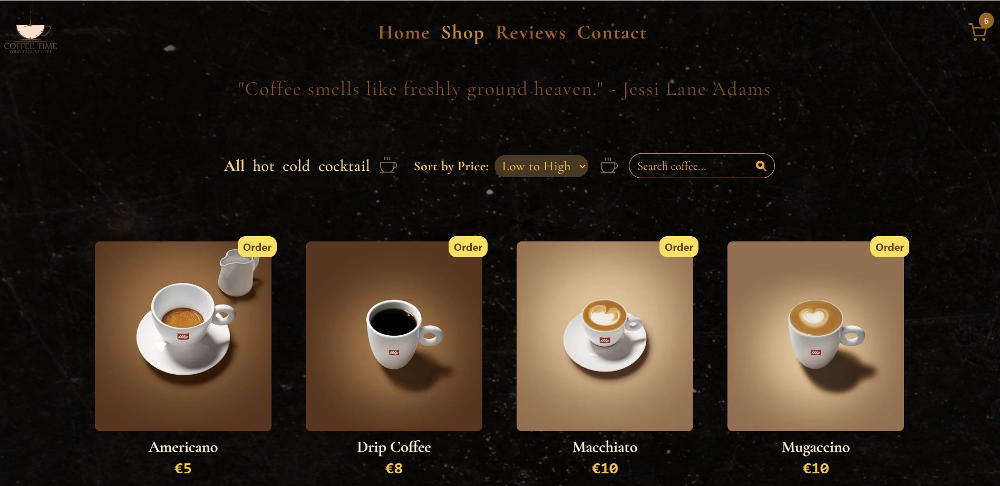

# Coffee Shop - E-Commerce Website

**Live Website**: [https://coffeeshop-delta.vercel.app/]



A simple and delightful Coffee Shop website built with React, React Router, and Tailwind CSS.

## Table of Contents

**Demo**
**Features**
**Getting Started**
**Prerequisites**
**Installation**
**Usage**
**Folder Structure**
**Built With**
**Contributing**
**License**

## Project Overview

 This project offers a seamless coffee shopping experience with the following key features:

- **Product Listings**: A wide range of coffees with detailed information is available for browsing.
- **Shopping Cart**: Users can add and remove items from their cart and view the total price.
- **Product Details**: Detailed coffee information: prices, preparation and recipes.
- **Search, sort and Filters**: Coffee can be easily found using the search bar, sorting function and filter options.
- **Animations and Visuals**: The website is enhanced with animations, sliders and more to engage users effectively.


## Built With

- React - JavaScript library for building user interfaces.
- React Router - Routing for React applications.
- Tailwind CSS - A utility-first CSS framework.


## Features

- Attractive and responsive user interface.
- Browse a selection of coffee products.
- Add products to the shopping cart.
- View and modify the cart contents.
- Contact the coffee shop via email.
- User-friendly navigation using the Navbar.


## Technologies Used

- **React.js**: The core framework for building the front-end.
- **React Router**: Used for navigation within the application.
- **React Icons**: Provides a wide range of icons for the user interface.
- **Tailwind CSS**: The CSS framework for styling.
- **Vite**: The development and bundling tool.
- **ESLint**: Ensures code quality through linting.
- **GitHub**: Used for version control.

## Installation

1. Clone the repository:

   ```bash
   git clone https://github.com/Ana-1995/coffeeshop.git
